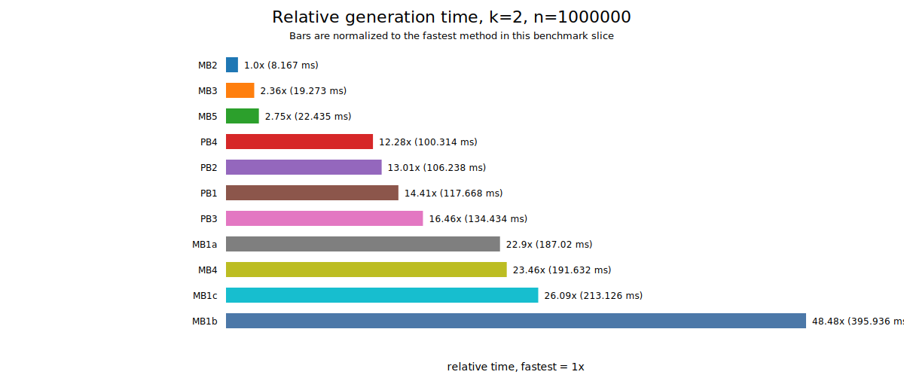
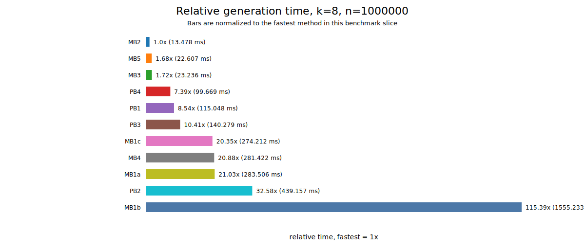
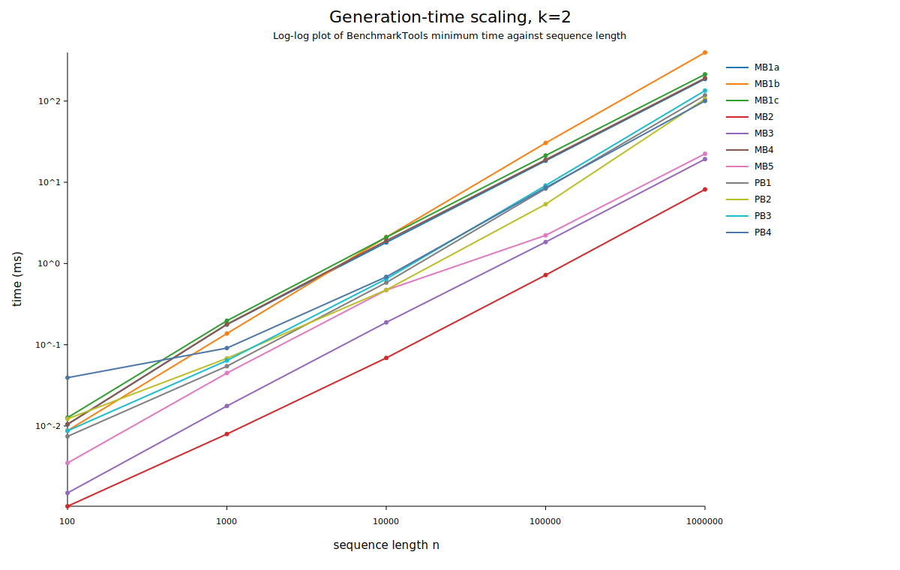
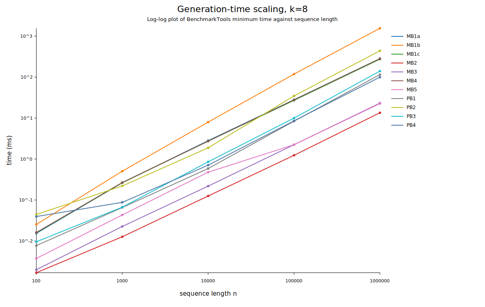

# Benchmark Results

Generated: 2026-06-29 09:49

These results are machine-specific BenchmarkTools measurements of generator hot paths after construction. Times are the minimum observed generation time for each benchmarkable, so they are useful for relative comparison on this machine rather than as portable guarantees.

- Suite: `scaling`
- Sequence lengths: `100`, `1000`, `10000`, `100000`, `1000000`
- Alphabet sizes: `2`, `8`
- Samples per benchmark: `3`
- Seconds budget per benchmark: `0.1`
- Syntheses per BenchmarkTools trial: `10`
- Reported times: per-synthesis averages from each trial

## Relative Time

The relative-time plots are histogram-style horizontal bar charts. They normalize each method to the fastest method for the same `k` and largest `n` in this run.

At `k = 8` and `n = 1000000`:

| Method | Time (ms) | Relative | Trial allocations | Trial memory (bytes) |
|---|---:|---:|---:|---:|
| `MB2_OnOffMarkov_regimes=2_Lmin=10` | 13.478 | 1.0x | 480 | 80034320 |
| `MB5_DuplicationMutation_alpha=1.5` | 22.607 | 1.68x | 90 | 160802160 |
| `MB3_FSS_streams=8` | 23.236 | 1.72x | 60 | 80002320 |
| `PB4_IntermittentMapSymbols_z=1.6` | 99.669 | 7.39x | 320 | 280015840 |
| `PB1_SpectralFGN_fft=n` | 115.048 | 8.54x | 490 | 680022016 |
| `PB3_WaveletMarkov_spectral_regimes=2` | 140.279 | 10.41x | 730 | 760042736 |
| `MB1c_CalibratedAdditiveMarkov_d=100` | 274.212 | 20.35x | 80 | 160002720 |
| `MB4_HawkesSymbol_d=100` | 281.422 | 20.88x | 80 | 160002720 |
| `MB1a_LAMP_d=100` | 283.506 | 21.03x | 80 | 160002720 |
| `PB2_LGCM_iters=8` | 439.157 | 32.58x | 1630 | 4560067568 |
| `MB1b_DyadicLAMP_d=100000` | 1555.233 | 115.39x | 130 | 800045120 |

## Scaling With Sequence Length

The scaling plots show time versus generated sequence length on log-log axes for each fixed alphabet size.

## Interpretation

- This rare scaling run omits `k = 64` to focus on sequence-length behavior for `k = 2` and `k = 8`.
- `OnOffMarkov`, `FSS`, and `DuplicationMutation` are the fastest cases in this grid because their hot paths avoid scanning long histories.
- `SpectralFGN`, `IntermittentMapSymbols`, and spectral-driver `WaveletMarkov` scale well with `n`; their visible cost is mostly FFT/rank-binning and sequential emission work.
- `LGCM` grows strongly with alphabet size because it generates one latent stream per symbol and performs calibration/argmax work.
- `LAMP`, `CalibratedAdditiveMarkov`, `HawkesSymbol`, and especially `DyadicLAMP` pay for explicit or approximate history handling. Their relative cost rises when configured memory depth or alphabet size increases.
